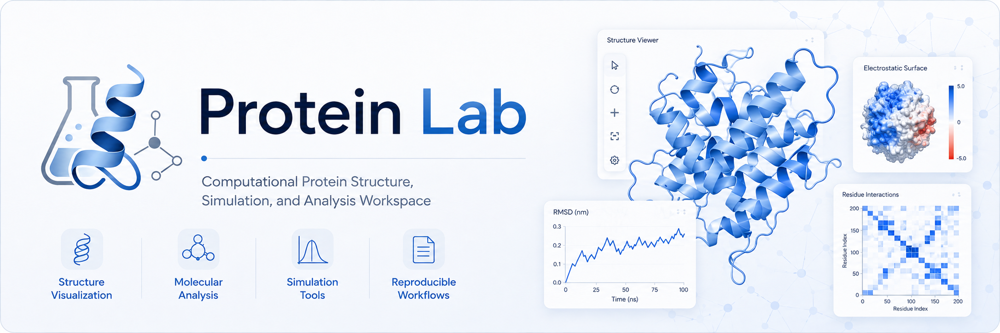

<p align="center">
  
</p>

# Protein Lab

Protein Lab is a native Windows desktop application for interactive protein structure visualization, protein construction, molecular-mechanics preparation and simulation, mutation experiments, structural analysis, and reproducible computational workflows.

The application uses explicit molecular coordinates and established computational methods. Predicted structures, force-field calculations, molecular-dynamics trajectories, and experimental/source structures are kept distinct in the interface and provenance records.

## Download

The current Windows build is available at [`release/ProteinLab.exe`](release/ProteinLab.exe).

Open `ProteinLab.exe` normally. On first launch it prepares its private runtime, installs missing pinned scientific dependencies, validates the installation, creates Desktop and Start Menu shortcuts, and opens the application. No separate Python, conda, Node.js, or browser setup is required for normal use.

## Features

- Native PySide6/VTK desktop interface with light mode and Research mode as defaults.
- Searchable Protein Toolbox with built-in proteins, user-imported proteins, and scientific tools.
- PDB and PDBx/mmCIF import with a persistent **My Proteins** library.
- Protein creation from amino-acid or coding-DNA text.
- Optional ESMFold sequence-to-structure prediction.
- Ribbon, ball-and-stick, sticks, and space-filling molecular representations.
- Coordinate-exact distance, angle, and signed-dihedral measurements.
- OpenMM structure preparation, energy inspection, minimization, NVT/NPT molecular dynamics, and membrane-system construction.
- Trajectory playback, Kabsch-aligned RMSD/RMSF, SASA, hydrogen-bond geometry, residue contacts, and occupancy-derived free-energy landscapes.
- Mutation workflows, ligand-pocket analysis, multi-chain interface analysis, structural validation, and structure comparison.
- Searchable Help Aid and Calculation Inspector with equations, assumptions, units, and limitations.
- Experiment Notebook, settings-derived Methods generation, exports, and portable `.plab` project files.
- Built-in Validation Center and deterministic numerical tests.

## Scientific scope

Protein Lab is computational modeling software. Its outputs must be interpreted according to the method that produced them.

- Force fields are approximations.
- Predicted structures are not experimental structures.
- Energy minimization is a local optimization, not proof of a native fold.
- Short molecular-dynamics trajectories do not establish biological-timescale behavior.
- Geometric contacts are not binding affinities.
- SASA is not solvation free energy.
- Occupancy-derived free-energy landscapes depend on sampling and convergence.

See [`docs/KNOWN_LIMITATIONS.md`](docs/KNOWN_LIMITATIONS.md) and [`docs/VALIDATION.md`](docs/VALIDATION.md) for details.

## Privacy and network use

Most structure viewing, simulation, analysis, project, and notebook operations run locally. First-run setup may download the pinned runtime and scientific packages. Optional ESMFold prediction sends the submitted amino-acid sequence to an external service when enabled.

See [`docs/PRIVACY.md`](docs/PRIVACY.md) before using automatic prediction with restricted or confidential sequences.

## Documentation

- [`docs/INSTALLATION.md`](docs/INSTALLATION.md) — installation and update behavior
- [`docs/USER_GUIDE.md`](docs/USER_GUIDE.md) — complete workflow and tool guide
- [`docs/VALIDATION.md`](docs/VALIDATION.md) — validation approach and release checks
- [`docs/KNOWN_LIMITATIONS.md`](docs/KNOWN_LIMITATIONS.md) — current scientific and technical limitations
- [`docs/PRIVACY.md`](docs/PRIVACY.md) — local and external data handling

## Running from source

Protein Lab targets Python 3.13 on Windows.

```powershell
python -m venv .venv
.venv\Scripts\Activate.ps1
python -m pip install -r requirements.txt
python -m proteinlab
```

Run the deterministic checks with:

```powershell
python -m unittest discover -s tests -v
python -m proteinlab.selftest --quick
python -m proteinlab.release_gate
```

## Repository layout

```text
proteinlab/          Application source
PeptideBuilder/      Bundled peptide-builder component
assets/              Application icon and splash assets
docs/                User, validation, limitation, and privacy documentation
release/             Current Windows executable and checksum
tests/               Deterministic tests
.github/              Basic GitHub CI, release automation, and issue forms
```

## Citation

If Protein Lab is used in academic work, cite the software version and the underlying scientific methods and dependencies that generated the reported result. Machine-readable citation metadata is provided in [`CITATION.cff`](CITATION.cff).

## License

Protein Lab is source-available. See [`LICENSE`](LICENSE). Bundled third-party components retain their own licenses; the PeptideBuilder notice is included under [`THIRD_PARTY_LICENSES/`](THIRD_PARTY_LICENSES/).
